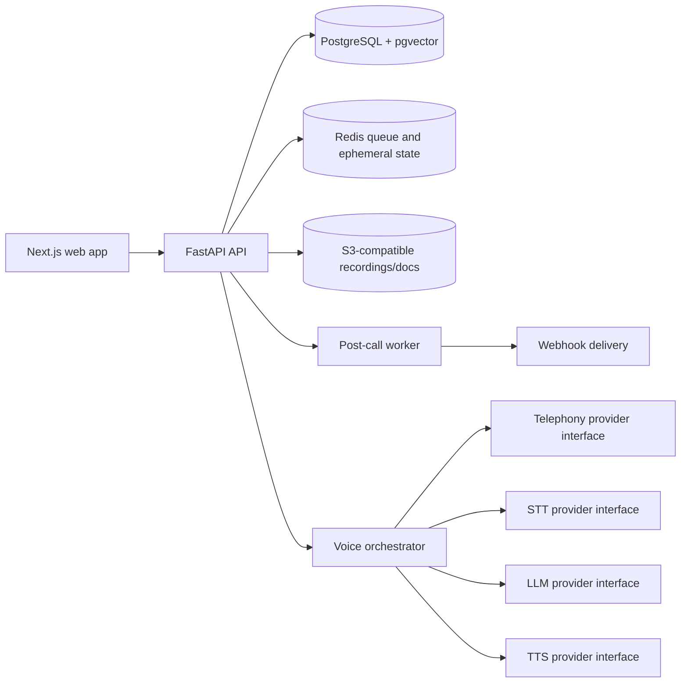
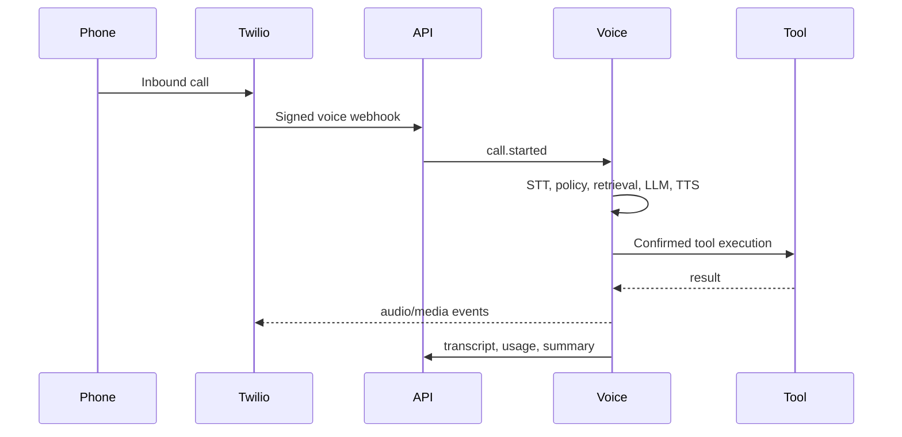
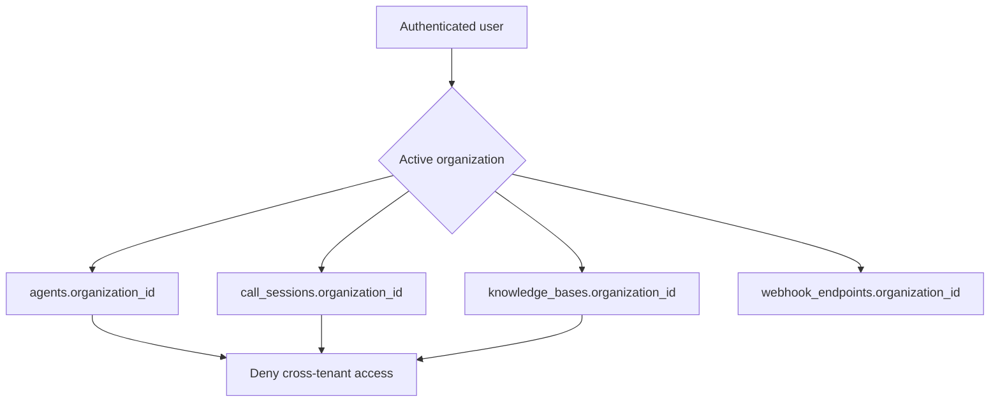
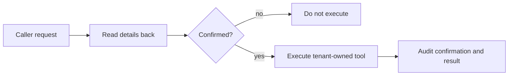

# Architecture

Votell uses a TypeScript-first workspace with a Next.js web app, shared contracts, and a FastAPI backend surface. Local demo mode keeps external provider behavior mocked while preserving provider interfaces for telephony, STT, TTS, LLM, embeddings, webhooks, usage, and post-call work.

